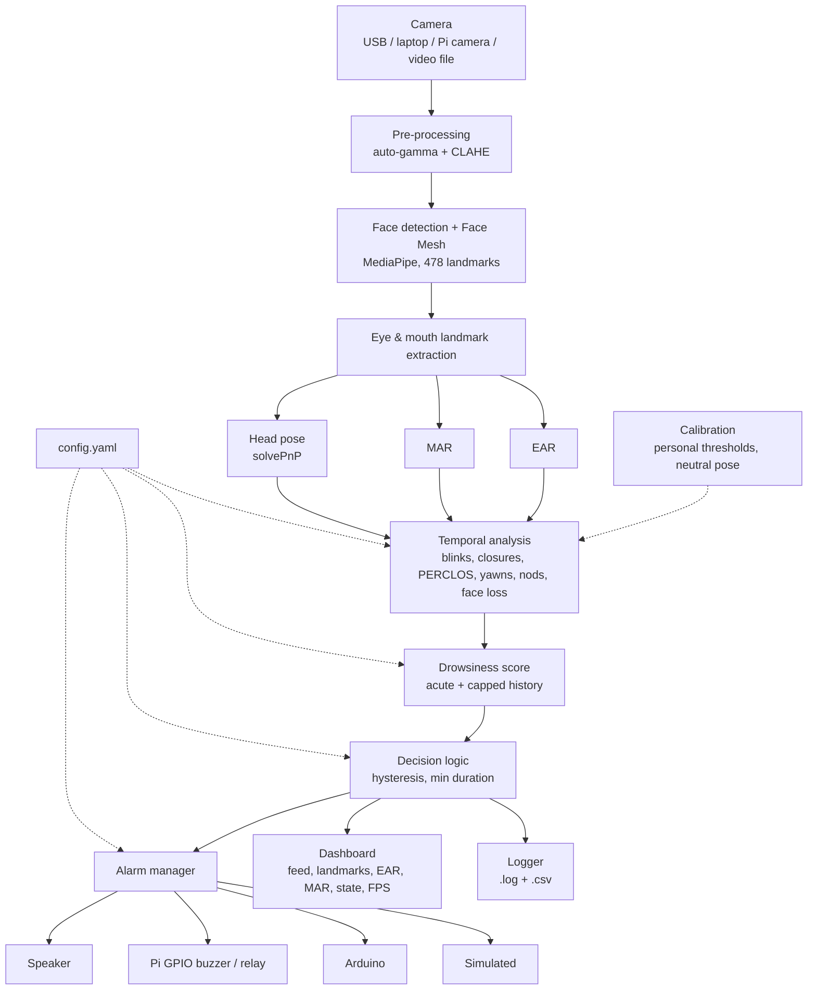
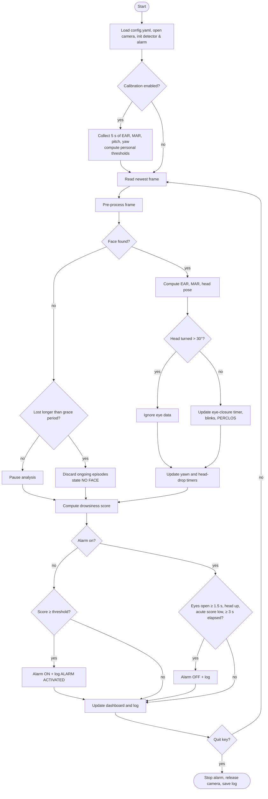

# Driver Drowsiness Detection and Alarm System

A real-time, camera-based driver monitoring prototype. It tracks the driver's face with
MediaPipe, measures eye closure (EAR), yawning (MAR) and head pose, analyses them over
time, combines them into a drowsiness score and sounds an alarm when prolonged drowsiness
is detected. It runs in real time on an ordinary laptop or a Raspberry Pi 4/5.

> ## ⚠ Safety notice
> This is a **driver-assistance prototype for education and demonstration**. It is **not a
> certified automotive safety system** and must **not** be relied upon as the sole safety
> mechanism in a real vehicle. Camera-based detection can fail (lighting, sunglasses,
> occlusion, unusual faces, software faults). Never test it while actually driving; use a
> desk setup or a parked vehicle. A drowsy driver's only safe response is to stop and rest.

---

## Contents

1. [Project folder structure](#1-project-folder-structure)
2. [Source code overview](#2-source-code-overview)
3. [requirements.txt](#3-requirementstxt)
4. [Installation](#4-installation)
5. [Camera setup](#5-camera-setup)
6. [Alarm / buzzer setup](#6-alarm--buzzer-setup)
7. [Configuration](#7-configuration)
8. [Test procedure](#8-test-procedure)
9. [EAR and MAR calculations](#9-ear-and-mar-calculations)
10. [Drowsiness detection algorithm](#10-drowsiness-detection-algorithm)
11. [System architecture diagram](#11-system-architecture-diagram)
12. [Flowchart](#12-flowchart)
13. [Sample output](#13-sample-output)
14. [Troubleshooting](#14-troubleshooting)
15. [Limitations and evaluation](#15-limitations-and-evaluation)
16. [Future work: CNN / LSTM](#16-future-work-cnn--lstm)
17. [License](#17-license)

---

## 1. Project folder structure

```
drowsiness_detection/
├── main.py                     # application entry point (real-time loop)
├── config.yaml                 # ALL thresholds and settings (calibration/configuration file)
├── requirements.txt
├── LICENSE
├── README.md
├── src/
│   ├── config.py               # YAML loader + validation
│   ├── camera.py               # threaded webcam / Pi camera / video-file input
│   ├── preprocessing.py        # lighting compensation (auto-gamma + CLAHE)
│   ├── landmark_detector.py    # MediaPipe Face Mesh (legacy or Tasks API)
│   ├── metrics.py              # EAR, MAR, landmark indices, smoothing
│   ├── head_pose.py            # pitch / yaw / roll with solvePnP
│   ├── calibration.py          # per-driver thresholds + neutral head pose
│   ├── temporal_analyzer.py    # blinks, closures, PERCLOS, yawns, nods, face loss
│   ├── drowsiness_scorer.py    # combines indicators into one score
│   ├── decision.py             # detection state + alarm on/off (hysteresis)
│   ├── dashboard.py            # OpenCV real-time dashboard
│   ├── event_logger.py         # .log + .csv session logs
│   └── alarm/
│       ├── base.py             # AlarmBackend interface (add new hardware here)
│       ├── manager.py          # drives all configured backends together
│       ├── simulated.py        # console alarm (no hardware needed)
│       ├── audio.py            # speaker beep (pygame / winsound / bell)
│       ├── gpio.py             # Raspberry Pi buzzer or relay
│       └── serial_alarm.py     # Arduino over USB
├── hardware/
│   └── arduino_buzzer/arduino_buzzer.ino   # Arduino sketch (buzzer + relay)
├── tools/
│   ├── simulate_drive.py       # camera-free demo of the full decision logic
│   ├── test_camera.py          # find camera index, check FPS / brightness
│   ├── test_alarm.py           # check speaker / buzzer / relay / Arduino
│   └── download_model.py       # MediaPipe model for the Tasks engine
├── tests/                      # automated tests (unittest, no camera needed)
│   ├── helpers.py
│   ├── test_metrics.py
│   ├── test_head_pose.py
│   └── test_detection_logic.py
├── models/                     # face_landmarker.task goes here (Tasks engine only)
└── logs/                       # session logs are written here
```

## 2. Source code overview

Each module has one job, so parts can be replaced independently (e.g. swap the landmark
detector for a CNN, or add a new alarm output) without touching the rest.

| Module | Responsibility |
|---|---|
| `camera.py` | Reads frames in a background thread and always returns the newest frame, so processing never lags behind. Video files are read frame-by-frame with the video's own clock, so tests are reproducible. Auto-reconnects. |
| `preprocessing.py` | Brightens dark frames (gamma) and evens out harsh light (CLAHE on luminance). |
| `landmark_detector.py` | 478 facial landmarks. If several faces are visible, the largest detected face is currently treated as the driver. |
| `metrics.py` | EAR and MAR from landmark pixel coordinates. |
| `head_pose.py` | Head pitch/yaw/roll by fitting a generic 3-D face model with `cv2.solvePnP`. |
| `calibration.py` | 5 s at start-up: learns the driver's open-eye EAR, resting MAR and neutral head pose. |
| `temporal_analyzer.py` | Turns per-frame values into events and durations (all time-based, FPS-independent). |
| `drowsiness_scorer.py` | Weighted drowsiness score (acute + capped history). |
| `decision.py` | Chooses the displayed state and switches the alarm on/off with hysteresis. |
| `alarm/` | Hardware abstraction: every output implements `on()`, `off()`, `close()`. |
| `dashboard.py` | Live feed, landmarks, values, score bar, alarm banner, FPS. |
| `event_logger.py` | Timestamped `.log` and `.csv` files. |

**Current driver-selection limitation:** the system currently selects the largest detected
face when multiple faces are present. This is suitable for the intended single-driver
prototype setup but does not guarantee persistent driver identity in a multi-person scene.

## 3. requirements.txt

```
mediapipe>=0.10.14
opencv-contrib-python>=4.8
numpy>=1.24
PyYAML>=6.0
pygame>=2.5        # speaker alarm (optional)
pyserial>=3.5      # Arduino alarm (optional)
```

Raspberry Pi extras come from apt:

```
python3-picamera2
python3-gpiozero
```

The minimum versions above describe the supported dependency range. For reproducible
evaluation, record the exact package versions used for the experiment
(e.g. `pip freeze > requirements-lock.txt`).

## 4. Installation

**Requirements:** Python **3.9 – 3.12** (MediaPipe does not always support the newest Python
release immediately), a webcam, Windows 10/11, Ubuntu/Debian, macOS, or Raspberry Pi OS (64-bit).

```bash
# 1. get the project and enter it
cd drowsiness_detection

# 2. create and activate a virtual environment
python -m venv venv
# Windows:
venv\Scripts\activate
# Linux / macOS / Pi:
source venv/bin/activate

# 3. install dependencies
pip install --upgrade pip
pip install -r requirements.txt

# 4. check the installation (no camera needed)
python -m unittest discover -s tests -t . -v
python tools/simulate_drive.py

# 5. run
python main.py
```

### MediaPipe versions (important)

Recent MediaPipe releases removed the old `mp.solutions.face_mesh` API. The project supports both:

* `face_mesh.engine: auto` (default) uses the old API if it exists, otherwise the new **Tasks API**.
* The Tasks API needs a small model file. Download it once:
  ```bash
  python tools/download_model.py
  ```
  This saves `models/face_landmarker.task`.
* Alternatively install an older MediaPipe that still has `solutions` and needs no model file:
  ```bash
  pip install "mediapipe==0.10.14" "numpy<2"
  ```

### Raspberry Pi 4/5 (64-bit Raspberry Pi OS)

```bash
sudo apt update
sudo apt install -y python3-picamera2 python3-gpiozero python3-venv
python3 -m venv --system-site-packages venv
source venv/bin/activate
pip install -r requirements.txt
python tools/download_model.py
python main.py --alarm simulated,gpio
```

Use 640×480 (or 480×360) for real-time speed; set `refine_landmarks: false` if FPS is low.

## 5. Camera setup

1. **Position**: mount the camera in front of the driver, about 40–80 cm away, at or slightly
   below eye level (dashboard or behind the steering wheel). The whole face, both eyes and
   the mouth must be visible. Avoid steep angles; they distort EAR.
2. **Find the camera index**: `python tools/test_camera.py` lists working indices and shows the
   live image with resolution, FPS and brightness. Put the index in `camera.source`.
3. **Lighting**: light the face evenly from the front. Avoid a bright window behind the
   driver. The brightness shown by `test_camera.py` should be above ~70. `preprocessing.clahe`
   and `auto_gamma` compensate for moderate problems. For night use, an IR camera with IR
   LEDs (850 nm) can be considered; performance should still be evaluated under the intended
   lighting conditions.
4. **Raspberry Pi camera**: set `camera.backend: picamera2`. Enable the camera in
   `raspi-config` on older OS versions and check it with `rpicam-hello`.
5. **Recorded video**: `python main.py --source my_test.mp4` is excellent for repeatable demos.
6. **Calibrate** at start-up (automatic, 5 s): sit normally, look at the road/camera, eyes open,
   mouth closed. Press **c** to re-calibrate at any time (e.g. new driver, glasses on/off).

## 6. Alarm / buzzer setup

Choose outputs in `config.yaml → alarm.backends` or on the command line
(`--alarm simulated,audio,gpio,serial`). A backend that is not available is skipped with a
warning; the **simulated** (console) alarm can be used for development without hardware.

Check any output with:

```bash
python tools/test_alarm.py --alarm <name>
```

| Backend | Hardware | Setup |
|---|---|---|
| `simulated` | none | prints `BUZZER ON/OFF` to the console + on-screen warning |
| `audio` | laptop / USB speaker | `pip install pygame`; beep frequency & pattern in `alarm.audio` |
| `gpio` | Raspberry Pi + buzzer or relay | see wiring below; `alarm.gpio.pin` (BCM) |
| `serial` | Arduino Uno/Nano | upload `hardware/arduino_buzzer/arduino_buzzer.ino`, set `alarm.serial.port` |

### Raspberry Pi – buzzer

> **Do not connect an unspecified 5 V buzzer directly to a Raspberry Pi GPIO.**

For a 5 V buzzer or a higher-current load, use an appropriate transistor/MOSFET driver
or a suitable relay module so that the GPIO only drives the control input.

Example transistor arrangement:

```
GPIO18 ── 1 kΩ ──> transistor base/gate
GND ──────────────> transistor GND/source
5 V ──────────────> buzzer (+)
buzzer (-) ───────> transistor collector/drain
```

Use a component with ratings appropriate for the selected buzzer/load. If using an
inductive load, provide the appropriate flyback protection.

**Relay module:** module VCC → appropriate supply, GND → GND, IN → GPIO18. Configure
`alarm.gpio.device: relay` and the correct `active_high` value for the module.

Switch vehicle circuits only through properly rated and fused interfaces. Never connect
vehicle wiring directly to Raspberry Pi GPIO pins.

### Arduino

Buzzer on D8, relay module on D7, LED on D13.

The PC currently sends, at 9600 baud:

| Command | Meaning |
|---|---|
| `A` | alarm on |
| `S` | alarm off |

Port examples:

```
Windows: COM3
Linux:   /dev/ttyUSB0
         /dev/ttyACM0
```

On Linux, add your user to the `dialout` group if required, then log out and in again:

```bash
sudo usermod -aG dialout $USER
```

**Current communication limitation:** the serial protocol currently does not provide
command acknowledgements. A future reliability improvement should add acknowledgements
and connection monitoring so the application can distinguish between a command being sent
and the physical alarm successfully responding.

### Adding new hardware

For example, CAN bus or another vehicle alarm controller:

1. Subclass `src/alarm/base.py → AlarmBackend`.
2. Implement `on()` / `off()`.
3. Register the backend in `src/alarm/manager.py → _make()`.

## 7. Configuration

Everything is in **`config.yaml`** (commented). The most important calibration values:

| Setting | Default | Meaning |
|---|---|---|
| `eyes.ear_threshold` | 0.21 | EAR below this = eyes closed (replaced by calibration) |
| `eyes.closure_duration_threshold` | 1.8 s | continuous closure that alone raises the alarm |
| `eyes.blink_max_duration` | 0.4 s | shorter closures contribute 0 to the eye-closure score |
| `eyes.long_blink_min_duration` | 0.5 s | closures at least this long count as long blinks |
| `mouth.mar_threshold` | 0.60 | MAR above this = mouth wide open |
| `mouth.yawn_min_duration` | 1.5 s | open this long = yawn (talking is shorter) |
| `head.pitch_down_threshold` | 18° | head-drop angle relative to neutral |
| `head.nod_min_duration` | 0.4 s | head dips shorter than this are ignored |
| `head.head_drop_duration_threshold` | 2.0 s | sustained head drop that alone raises the alarm |
| `scoring.threshold` | 100 | drowsiness score that triggers the alarm |
| `alarm.min_duration` | 3.0 s | alarm duration: sounds at least this long |
| `alarm.release_time` | 1.5 s | eyes open this long before the alarm stops |
| `camera.width / height / fps` | 640×480 @ 30 | camera resolution and FPS |
| `calibration.enabled` | true | automatic per-driver calibration at start-up |

Invalid combinations (e.g. blink duration longer than the closure threshold) are rejected
at start-up with a clear message.

## 8. Test procedure

### A. Automated tests

```bash
python -m unittest discover -s tests -t . -v
```

The current automated test suite covers EAR/MAR geometry, head-pose sign convention and
detection logic including normal blinks, brief closure, face-detection failure, looking
sideways, small head movements, talking, detection timing, yawn counting, head drop and
combined indicators.

These tests validate the behaviour of the implemented logic. They do not by themselves
establish real-world drowsiness-detection accuracy.

### B. Logic demo

```bash
python tools/simulate_drive.py
```

This runs a scripted 60 s drive through the decision logic without requiring a camera.

### C. Live test protocol

Run `python main.py`, calibrate, then perform each step. Record the result in a table for
your report.

| # | Action | Expected result |
|---|---|---|
| 1 | Sit normally for 30 s, blink naturally | `ALERT`, short `BLINKING` flashes, no alarm |
| 2 | Blink quickly 10 times | `BLINKING`, no alarm |
| 3 | Close eyes for ~1 s | `EYES CLOSED`, score rises then falls, no alarm |
| 4 | Close eyes for 3 s | alarm after ≈ 1.8 s, banner `DROWSINESS DETECTED - TAKE A BREAK` |
| 5 | Open eyes and look ahead | alarm stops ≈ 1.5 s later (after at least 3 s of alarm) |
| 6 | Talk / read aloud for 20 s | no yawn counted |
| 7 | Yawn widely (≥ 2 s) | `YAWNING`, yawn counter +1, no alarm |
| 8 | Turn head to the side for 5 s | `LOOKING AWAY`, no alarm |
| 9 | Cover the camera for 2 s, then 8 s | `NO FACE` → `DRIVER NOT VISIBLE` warning, no drowsiness alarm |
| 10 | Let head drop forward for 3 s | `HEAD DROP`, then alarm |
| 11 | Yawn 3 times, then close eyes 1.3 s | alarm (combined score) although 1.3 s alone does not trigger |
| 12 | Repeat 1–5 in dim light and with glasses | behaviour should be evaluated and documented; re-calibrate with **c** if needed |

Measure **FPS** (dashboard) and **alarm latency** (log timestamps). Open the `.csv` log in
Excel to plot EAR, MAR and score over time for your report.

## 9. EAR and MAR calculations

### Eye Aspect Ratio (EAR)

Six landmarks per eye: two corners (p1, p4), two on the upper lid (p2, p3), two on the lower lid (p6, p5).

```
        p2     p3
  p1 ─────────────── p4          EAR = ( |p2 − p6| + |p3 − p5| ) / ( 2 · |p1 − p4| )
        p6     p5
```

* Numerator = vertical eye opening (two measurements, averaged by the factor 2).
* Denominator = eye width. Because EAR is a **ratio**, it does not change when the driver
  moves closer or further from the camera.
* Open eye ≈ 0.25–0.35; closed eye ≈ 0.05–0.15. The system averages both eyes.
* MediaPipe indices — right eye: 33, 160, 158, 133, 153, 144; left eye: 362, 385, 387, 263, 373, 380.
* Worked example: eye 30 px wide, lids 9 px apart → EAR = (9 + 9)/(2·30) = **0.30** (open).
  Lids 3 px apart → (3 + 3)/60 = **0.10** (closed).
* Calibration sets the personal threshold to **0.75 × the driver's open-eye EAR**
  (limited to 0.15–0.28), because eye shape differs between people.

### Mouth Aspect Ratio (MAR)

Eight landmarks on the inner lips: corners p1 (61) and p5 (291), upper lip p2, p3, p4
(81, 13, 311), lower lip p8, p7, p6 (178, 14, 402).

```
        p2  p3  p4
  p1 ───────────────── p5        MAR = ( |p2 − p8| + |p3 − p7| + |p4 − p6| ) / ( 2 · |p1 − p5| )
        p8  p7  p6
```

* Closed ≈ 0–0.1, talking ≈ 0.2–0.5, yawning > 0.6.
* A wide-open mouth alone could be talking or singing, so a **yawn requires MAR > threshold
  for ≥ 1.5 s**.

### Head pose

Six landmarks (nose tip, chin, eye corners, mouth corners) are matched to a generic 3-D face
model with `cv2.solvePnP`; the rotation is decomposed into pitch (nodding), yaw (turning) and
roll. Angles are used **relative to the calibrated neutral pose**. Positive pitch = head down
(verified by `tests/test_head_pose.py`; set `head.invert_pitch: true` if your setup reports
the opposite).

## 10. Drowsiness detection algorithm

**Step 1 – per frame:** EAR, MAR, pitch, yaw (smoothed with an exponential moving average).

**Step 2 – temporal analysis** (time-based, FPS-independent, with hysteresis on every threshold):

| Indicator | Rule |
|---|---|
| Blink | eyes closed < 0.5 s (contributes 0 to the eye-closure score if < 0.4 s) |
| Long blink | eyes closed ≥ 0.5 s (fatigue sign) |
| Micro-sleep | eyes closed ≥ 1.8 s |
| PERCLOS | % of time eyes closed during the last 60 s |
| Reduced blinking | < 6 blinks/min over the last 60 s |
| Yawn | MAR > threshold for ≥ 1.5 s; counted over 3 min |
| Head drop / nod | pitch > 18° below neutral for ≥ 0.4 s; counted over 2 min. A drop lasting 2.0 s raises the alarm on its own |
| Looking away | yaw > 35° → state `LOOKING AWAY`; eye data ignored above 30° |

**Step 3 – score:**

```
ACUTE      = Eye closure score + Head-drop score + Yawn-in-progress score
             100·clamp((t_closed − 0.4)/(1.8 − 0.4))
           + 100·clamp((t_down − 0.4)/(2.0 − 0.4))
           + 10
CUMULATIVE = PERCLOS score + 15·yawns + 15·nods
             + 8·long blinks + 10 (if low blink rate)
             (capped at 60)
TOTAL      = ACUTE + CUMULATIVE
```

**Step 4 – decision:**

* Alarm **ON** when TOTAL ≥ 100.
* Alarm **OFF** when it has sounded ≥ 3 s, the eyes have been open ≥ 1.5 s, the head is up
  and ACUTE < 40.

> **Note:** The exact scoring weights and thresholds are configuration/design choices. Their
> real-world performance still needs to be evaluated across subjects and conditions.

### Mechanisms used to reduce false alarms

* A normal blink contributes 0 to the eye-closure score because scoring starts after
  the configured blink duration.
* One closed-eye frame cannot trigger the alarm; continuous closure is required.
* History is capped at 60, so yawning or past blinks cannot trigger the alarm by themselves.
* Face loss does not count as drowsiness. Extended face loss discards ongoing episodes and
  produces a `DRIVER NOT VISIBLE` warning.
* Head turned sideways → EAR is treated as unreliable and is ignored.
* Short head movements below the configured duration are ignored.
* Separate ON/OFF conditions and minimum alarm duration reduce alarm flicker.

These mechanisms are intended to reduce false alarms; real-world false-alarm performance
must be established through evaluation.

## 11. System architecture diagram



Plain-text version (for printed reports):

```
Camera → Pre-processing → Face detection → Facial landmarks → Eye & mouth landmarks
       → EAR + MAR + Head pose → Temporal analysis → Drowsiness score → Decision logic
       → Alarm (speaker / GPIO / Arduino / simulated) + Warning display + Log
```

## 12. Flowchart



## 13. Sample output

Excerpt from `python tools/simulate_drive.py` (scripted drive, same logic as the live system):

```
07:47:50 | EAR: 0.23 | MAR: 0.06 | SCORE:   0.0 | STATUS: LOOKING AWAY
07:47:57 | YAWN STARTED
07:47:57 | EAR: 0.23 | MAR: 0.86 | SCORE:  25.0 | STATUS: YAWNING
07:47:59 | YAWN ENDED (3.0s)
07:48:02 | EAR: 0.11 | MAR: 0.06 | SCORE:  15.0 | STATUS: EYES CLOSED
07:48:02 | LONG BLINK (0.80s)
07:48:06 | EAR: 0.20 | MAR: 0.06 | SCORE:  23.0 | STATUS: BLINKING
07:48:06 | EAR: 0.12 | MAR: 0.06 | SCORE:  23.0 | STATUS: EYES CLOSED
07:48:07 | ALARM ACTIVATED
[SIMULATED ALARM] >>> BUZZER ON  - DROWSINESS DETECTED - TAKE A BREAK <<<
07:48:07 | EAR: 0.12 | MAR: 0.05 | SCORE: 101.2 | STATUS: DROWSY
07:48:08 | MICROSLEEP (2.60s)
07:48:10 | ALARM DEACTIVATED - driver alert again
07:48:17 | HEAD DROP (pitch +28 deg)
07:48:17 | EAR: 0.27 | MAR: 0.06 | SCORE:  61.5 | STATUS: HEAD DROP
07:48:18 | ALARM ACTIVATED
07:48:18 | EAR: 0.27 | MAR: 0.06 | SCORE: 100.8 | STATUS: DROWSY
07:48:20 | HEAD UP (3.0s)
07:48:21 | ALARM DEACTIVATED - driver alert again
07:48:36 | SIMULATION ENDED | alarms: 2 | blinks: 5 | yawns: 1 | nods: 1
```

The live system additionally logs calibration, for example:

```
CALIBRATION OK (148 samples): open EAR 0.302 -> threshold 0.227; rest MAR 0.04 -> yawn threshold 0.60; neutral pitch +8.4, yaw -2.1
```

The `.csv` log has columns:

```
timestamp, ear, mar, pitch, yaw, perclos, blink_rate,
score, acute, cumulative, state, alarm
```

**Dashboard:** live video with face box, landmarks, eye contours (cyan, orange when closed),
EAR/MAR points, mouth contour; side panel with coloured state box (ALERT / BLINKING / EYES CLOSED /
YAWNING / HEAD DROP / LOOKING AWAY / NO FACE / DROWSY), EAR and threshold, MAR and threshold,
pitch/yaw, closure time, PERCLOS, blink rate, counters, score bar with threshold marker,
alarm status and FPS.

During an alarm the frame flashes red with the banner `DROWSINESS DETECTED - TAKE A BREAK`.

Keys: **q** quit · **c** re-calibrate · **t** test alarm · **r** reset statistics.

## 14. Troubleshooting

| Problem | Solution |
|---|---|
| `Cannot open camera/video source: 0` | Run `tools/test_camera.py` to find the right index; close other apps using the camera (Zoom, Teams, browser); on macOS allow camera access for Terminal/IDE; on Linux check `ls /dev/video*` and that your user is in the `video` group. |
| Camera opens slowly on Windows | Try another index or USB port; built-in cameras sometimes need a driver update. |
| `module 'mediapipe' has no attribute 'solutions'` / model not found | New MediaPipe: run `python tools/download_model.py` (engine `auto` then uses the Tasks API), or `pip install "mediapipe==0.10.14" "numpy<2"`. |
| `pip install mediapipe` fails | Your Python is too new or 32-bit; use 64-bit Python 3.10–3.12. |
| NumPy errors after installing | Version clash: `pip install "numpy<2"` for MediaPipe 0.10.14, otherwise upgrade MediaPipe. |
| No sound | `pip install pygame`; check system volume and output device; run `tools/test_alarm.py --alarm audio`. The console alarm always works. |
| Low FPS (< 15) | Use 640×480 or lower, `refine_landmarks: false`, `preprocessing.clahe: false`, close other programs; on a Pi use 480×360. |
| Alarms while eyes are open (small eyes, glasses) | Re-calibrate (**c**) looking straight ahead; lower `calibration.ear_ratio` (e.g. 0.70) or `eyes.ear_threshold`; reduce glasses reflections by tilting the camera slightly. |
| Closed eyes not detected | Raise `calibration.ear_ratio` (0.8) / `eyes.ear_threshold`; check EAR on the dashboard with eyes open vs closed. |
| Yawns not counted / talking counted | Adjust `mouth.mar_threshold` using the MAR shown on screen; increase `yawn_min_duration`. |
| `HEAD DROP` when looking up (or never) | Set `head.invert_pitch: true`; re-calibrate with a neutral head position; adjust `pitch_down_threshold`. |
| Frequent `NO FACE` | Improve front lighting, keep the full face in view, move closer, lower `min_detection_confidence` to 0.4. |
| Sunglasses | Eyes cannot be measured reliably through dark lenses; the system relies on yawns and head pose when eye measurements are unavailable. |
| Arduino not responding | Correct port in config; close the Arduino Serial Monitor (it blocks the port); `dialout` group on Linux; baud rate 9600 in both sketch and config. |
| GPIO error on Pi | Install `python3-gpiozero`, create the venv with `--system-site-packages`, check BCM pin number and wiring. |
| Dashboard does not open over SSH | Run `python main.py --no-display` (headless) or use VNC. |

## 15. Limitations and evaluation

The current system is a rule-based driver-monitoring prototype using facial landmarks,
geometric measurements and temporal thresholds. The automated tests verify that the
implemented detection logic behaves as designed, but they do not establish general
drowsiness-detection accuracy across different people and environments.

### Known limitations

* The largest detected face is currently treated as the driver when multiple faces are present.
* Camera failure and recovery require explicit handling so that the user is not left with a
  stale monitoring state.
* The Arduino serial protocol currently does not provide command acknowledgements.
* Alarm backend activation is not yet equivalent to confirmed physical hardware activation.
* Dark sunglasses and severe facial occlusion can make eye measurements unreliable.
* Thresholds and scoring weights require evaluation across different subjects and conditions.
* Performance can vary with lighting, camera position, frame rate and face orientation.

### Planned evaluation

A real-world evaluation should include labelled recordings from different subjects and
conditions, including:

* Different people
* Different lighting conditions
* With and without glasses
* Different head positions
* Different camera distances
* Normal blinking
* Eye closure
* Yawning
* Head movement
* Temporary face loss

The following metrics should be recorded:

* False alarms per hour
* Missed events
* Alarm trigger latency
* Measurement/face-loss rate
* Processing FPS
* Alarm recovery time

Data used for threshold tuning should be kept separate from the final evaluation data.

The same recordings should also be tested at different processing frame rates where possible
to verify the FPS-independent temporal analysis.

Results should be reported with the evaluation conditions and limitations clearly documented.

## 16. Future work: CNN / LSTM

The geometric approach is fast and explainable, but thresholds do not suit every face and
it cannot learn subtle patterns. A learned version could be added step by step:

1. **Collect data** with this system: the `.csv` logs plus saved eye/mouth crops, labelled
   alert / drowsy (e.g. with the Karolinska Sleepiness Scale). Public datasets: NTHU-DDD,
   UTA-RLDD (Real-Life Drowsiness Dataset), YawDD (yawning), MRL Eye Dataset, CEW (closed eyes).
2. **CNN eye-state classifier**: a small CNN (MobileNetV3-Small, or a custom 3–4 layer CNN on
   24×24–64×64 grey eye crops) that outputs P(eye closed). More robust than EAR for glasses,
   odd angles and different eye shapes. Plugs in by replacing `compute_ear()` with the CNN
   probability.
3. **LSTM / GRU / Temporal CNN for drowsiness over time**: input sequences of per-frame
   features (EAR or CNN eye probability, MAR, pitch, yaw, blink durations) over 30–60 s;
   output a drowsiness level. This can learn temporal patterns such as slowing blinks and
   increasing closure duration before a micro-sleep.
4. **End-to-end CNN-LSTM** on face-crop sequences, or a 3-D CNN, for a learned temporal model
   if a suitable GPU / accelerator is available.
5. **Deployment**: convert to TensorFlow Lite or ONNX, INT8-quantise, and run on a Pi with a
   suitable accelerator or on a Jetson-class device.
6. **Other improvements**: IR camera + IR illumination for night driving; steering-wheel or
   lane-keeping signals from the vehicle CAN bus fused with vision; per-driver profiles;
   an escalation strategy (visual → sound → seat vibration); a mobile app for trip reports.
7. **Evaluation**: report accuracy, precision/recall, false-alarm rate per hour and detection
   latency, using leave-one-subject-out cross-validation where the dataset supports it.

The current rule-based system should remain available as a transparent baseline for comparison
with any learned model.

## 17. License

This project is licensed under the MIT License. See the [LICENSE](LICENSE) file for the full
license text.

Third-party libraries, models, datasets and other external components remain subject to
their respective licenses and terms.

---

*Reminder: this prototype is for learning and demonstration only — it is not a certified
safety device and must not be the only safety measure in a real vehicle.*

## Author

**Dhruvraj Singh Shekhawat**  

[GitHub](https://github.com/dhruxraj)

## Contributors

Thanks to everyone who has contributed to this project.

<a href="https://github.com/dhruxraj/drowsiness_detection/graphs/contributors">

  

</a>
